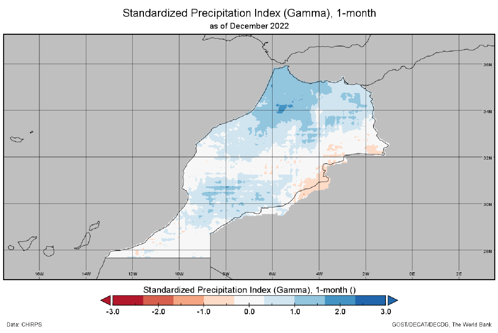
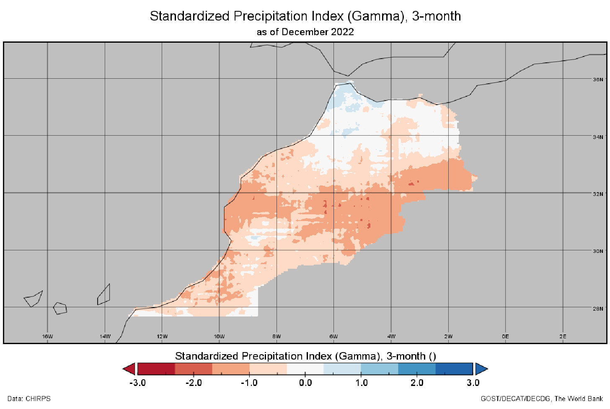
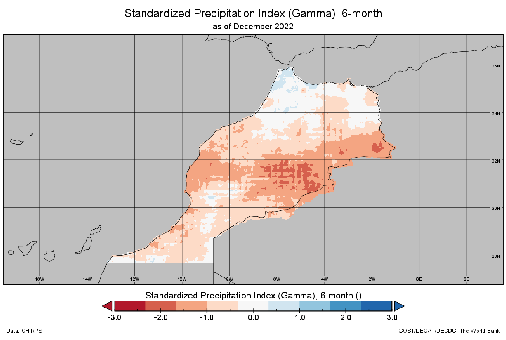
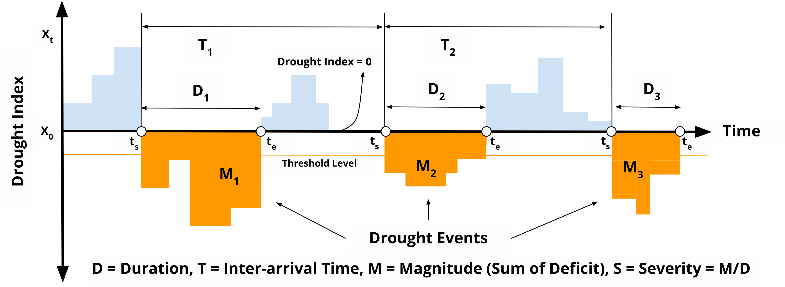

# Satellite-based monitoring of drought conditions

Drought is a complex phenomenon that encompasses various elements including meteorological, hydrological, and agricultural components, each with its own characteristics and impacts. As such, no single index can perfectly capture and quantify all aspects of a drought. Many indices have been developed to measure different features of droughts, but each has its limitations due to the multifaceted nature of drought.

One widely used drought index is the Standardized Precipitation Index (SPI). The SPI is a simple, robust, and versatile index that allows for comparison across different regions and climates. The SPI can be useful for detecting meteorological droughts, as it primarily focuses on rainfall deficits.

However, the SPI does not account for other critical elements such as temperature, evaporation, soil moisture, and the impact on vegetation, which are important for understanding agricultural and hydrological droughts. Therefore, while the SPI is a valuable tool in drought monitoring, it should be used in conjunction with other indices and measurements to gain a comprehensive understanding of drought conditions. This illustrates the principle that while individual indices can provide valuable insights, no single index can perfectly capture the entirety of a drought.

The emergence of satellite-based climate data has added a new dimension to drought analysis. Satellite-derived precipitation estimates, for instance, can be utilized to enhance the SPI's capabilities, offering more comprehensive insights.

## Standardized Precipitation Index

The Standardized Precipitation Index ([SPI](https://library.wmo.int/doc_num.php?explnum_id=7768)) is a normalized index first developed by McKee et al. (1993). The SPI is used for estimating wet or dry conditions based on the `precipitation` variable. This wet or dry condition can be monitored by the SPI on a variety of time scales from subseasonal to interannual scales.  

The SPI calculation is based on the long-term precipitation record for a particular location and long-term period (longer than 30 years is desirable). The calculation method consists of a transformation of one frequency distribution (e.g., gamma) to another frequency distribution (normal, or Gaussian). The first step to calculate SPI is to adequately choose a particular probability distribution (e.g., gamma distribution, incomplete beta distribution (McKee et al. 1993, 1995), and Pearson III distribution (Guttman 1998, 1999) that reliably fits the long-term precipitation time series and conducts fitting to that distribution.   

Gamma distribution has been widely used, as the gamma distribution has been understood as the reliable fit to the precipitation distribution. The fitting can be achieved through the maximum likelihood estimation of the gamma distribution parameters. The percentile value from this probability distribution is then transformed to the corresponding value in the new probability distribution. As a result, the probability that the rainfall is less than or equal to any rainfall amount will be the same as the probability that the new variate is less than or equal to the corresponding value of that rainfall amount. The normal distribution is usually used for this another transformation so that the mean and standard deviation of the SPI for a certain station and long-term period is zero and one, respectively (Edwards and McKee 1997).   
  
### Interpretation

The SPI maps can be interpreted at various time scales. This in turn indicates that the SPI is useful in both short-term and long-term applications. These time scales reflect the impact of drought on the availability of the different water resources. For instance, soil moisture conditions respond to precipitation anomalies on a relatively short scale. Groundwater, streamflow, and reservoir storage reflect the longer-term precipitation anomalies.

The threshold and the symbology for the SPI can follow below color codes and image.  

| Class  | Threshold  | Hex  | RGB  |
|---|---|---|---|
| Exceptionally Dry  | -2.00 and below  | `#760005`   | rgb(118, 0, 5)  |
| Extremely Dry  | -2.00 to -1.50  | `#ec0013`   | rgb(236, 0, 19)  |
| Severely Dry  | -1.50 to -1.20  | `#ffa938`   | rgb(255, 169, 56)  |
| Moderately Dry  | -1.20 to -0.70  | `#fdd28a`   | rgb(253, 210, 138)  |
| Abnormally Dry  | -0.70 to -0.50  | `#fefe53`   | rgb(254, 254, 83)  |
| Near Normal  | -0.50 to +0.50  | `#ffffff`   | rgb(255, 255, 255)  |
| Abnormally Moist  | +0.50 to +0.70  | `#a2fd6e`   | rgb(162, 253, 110)  |
| Moderately Moist  | +0.70 to +1.20  | `#00b44a`   | rgb(0, 180, 74)  |
| Very Moist  | +1.20 to +1.50  | `#008180`   | rgb(0, 129, 128)  |
| Extremely Moist  | +1.50 to +2.00  | `#2a23eb`   | rgb(42, 35, 235)  |
| Exceptionally Moist  | +2.00 and above  | `#a21fec`   | rgb(162, 31, 236)  |

### Strengths and Limitations

1. Used for estimating meteorological conditions based on precipitation alone.
2. Wet or dry conditions can be monitored on a variety of time scales from sub seasonal to interannual
3. Can be compared across regions with markedly difference climates
4. Does not consider the intensity of precipitation and its potential impacts on runoff, streamflow, and water availability
5. Expressed as the number of standard deviations from the long term mean, for a normally distributed random variable, and fitted probability distribution for the actual precipitation record
6. SPI values < -1 indicate a condition of drought, the more negative the value the more severe the drought condition. SPI values > +1 indicate wetter conditions compared to a climatology

### Examples

Below is the SPI example for different time scale and how to interpret the value, following the guideline from the US [National Drought Mitigation Center](https://drought.unl.edu/Monitoring/SPI/MapInterpretation.aspx)

* SPI 1-month
	
	Reflects relatively short term conditions. Its application can be related closely with short term soil moisture and crop stress. Interpretation of the 1-month SPI may be misleading unless climatology is understood. In regions where rainfall is normally low during a month, large negative or positive SPIs may result even though the departure from the mean is relatively small. 

	

* 3 month
	
	Provides a comparison of the precipitation over a specific 3 month period with the precipitation totals from the same 3 month period for all the years included in the historical record. Reflects short and medium term moisture conditions and provides a seasonal estimation of precipitation.

	

* 6 month

	Compares the precipitation for that period with the same 6 month period over the historical record. A 6 month SPI can be very effective in showing the precipitation over distinct seasons and may be associated with anomalous streamflow and reservoir levels.

	

* 9 month

	Provides an indication of precipitation patterns over a medium time scale. SPI values below 1.5 for these time scales are usually a good indication that significant impacts are occurring in agriculture and may be showing up in other sectors as well.

	

* 12 month

	Reflects long term precipitation patterns. Longer SPIs tend toward zero unless a specific trend is taking place. SPIs of these time scales are probably tied to streamflow, reservoir levels, and even groundwater levels at the longer time scales. In some locations of the country, the 12 month SPI is most closely related with the Palmer Index, and the two indices should reflect similar conditions.

	

## SPI-based drought characteristics

Droughts usually take a season or more to develop. Longer time scales (>12 months) are better to measure the effects of a precipitation deficit on different water resource components (stream flow, soil moisture, groundwater and reservoir storage) and the impact to agricultural practices in longer term.

Numerous indices for measuring drought, including SPI, SPEI, PDSI, among others, have been suggested in various research studies. The choice of a particular index often depends on the data that is available. Even though the interpretation and definition varies for each index, most of them can be described using the run theory methodology.

The run theory was initially introduced by Yevjevich in [1967](https://www.engr.colostate.edu/ce/facultystaff/yevjevich/papers/Yevjevich_n1_1963.pdf) and has since been used to identify drought characteristics such as duration, severity, intensity, and interarrival.

Drought events and characteristics at all grid were identified using calculated monthly SPI for the total period of 43 years (1981–2021). Specifically, a drought event is defined as the period in which SPI is continuously below a critical threshold (-1.2, -1.5 and -2.0), respectively. 

For each category, we identified and analysed the following four main drought characteristics: events (E), duration (D), inter-arrival time (T), magnitude (M), and severity (S = M/D).

* Event: Number of months in which the SPEI is less than a threshold.
* Duration D: the number of consecutive months in which the SPEI is below the threshold.
* Inter-arrival T: the duration (month) between the initiation time of two successive drought events (regardless of the length) in the same drought category. It includes the drought and subsequent non-drought periods. Therefore, T characterizes the timing variability of drought events. 
* Magnitude M: the absolute cumulative SPEI value during drought events. Unitless
* Severity S: the number came from magnitude divided by duration to get level of severity. Unitless

## References

https://library.wmo.int/doc_num.php?explnum_id=7768
McKee, T. B., N. J. Doesken, and J. Kleist, 1993: The relationship of drought frequency and duration of time scales. Eighth Conference on Applied Climatology, American Meteorological Society, Jan17-23, 1993, Anaheim CA, pp.179-186.
McKee, T. B., N. J. Doesken, and J. Kleist, 1995: Drought monitoring with multiple time scales. Ninth Conference on Applied Climatology, American Meteorological Society, Jan15-20, 1995, Dallas TX, pp.233-236.
Guttman, N. B., 1998: Comparing the Palmer Drought Index and the Standardized Precipitation Index. J. Amer. Water Resources Assoc., 34(1), 113-121.
Guttman, N. B., 1999: Accepting the Standardized Precipitation Index: A calculation algorithm. J. Amer. Water Resources Assoc., 35(2), 311-322.
https://www.engr.colostate.edu/ce/facultystaff/yevjevich/papers/Yevjevich_n1_1963.pdf